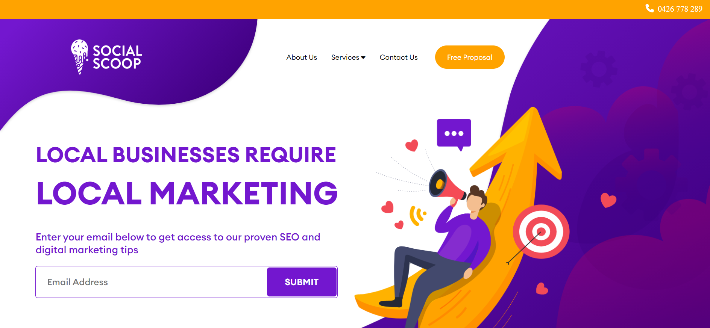

# HTML Template

A responsive HTML template for digital marketing agencies, featuring a hero banner with a call-to-action form and navigation menu.

## Live Demo

Explore the live demo [here](https://html-template-task.netlify.app/).

## Description

This project demonstrates a basic HTML template styled with CSS, incorporating:
- A top bar with contact information.
- A hero banner with navigation links and a subscription form.
- Custom fonts and FontAwesome icons.

## Preview

## Installation

To run this project locally, follow these steps:
1. Clone the repository: `git clone <repository-url>`
2. Open `index.html` in your web browser.

## Technologies Used

- HTML
- CSS
- FontAwesome

## License

This project is licensed under the MIT License. See the [LICENSE](LICENSE) file for more details.